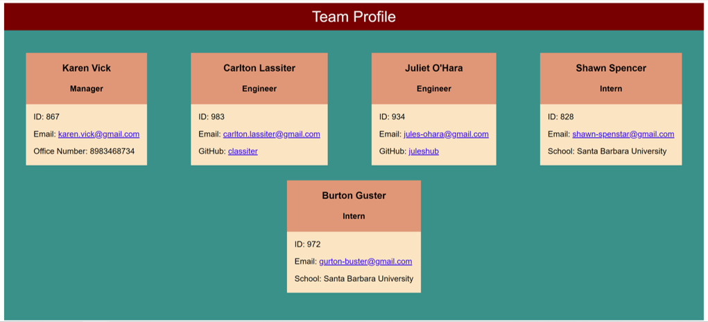

# Team Profile Generator
  
  
  ## Table of Contents
  [Description](#description)  
  [Installation](#installation)  
  [Usage](#usage)  
  [License](#license)    
  [Tests](#tests)  
  [Questions](#questions)
  ## Description
  Team Profile Generator is a Node.js command-line application that takes in information about employees on a software engineering team and generates an HTML webpage that displays summaries for each person. The codebase also includes unit tests for checking the functionality of class constructors.  
    

  
  ## Installation
  Open the project's repository, click the "Code" dropdown button, copy the SSH key, and input 'git clone SSH key' in the terminal in the root directory. This will create a local copy of the application, which you can use.
  ## Usage
  You can edit, add, or delete team member information after you create a local copy.
  Click the following link for a demo of how to generate a team profile using the app and run tests:
  https://drive.google.com/file/d/18oDmA4LmIILxEXDoam85_pvAwTmcUwvy/view
  ## License
  MIT
  Copyright (c) Anita Jose. All rights reserved. Licensed under the MIT license.
  ## Tests
  Tests are performed using Jest to ensure the class constructors behave as expected. Use "npm run test" to initialize the tests.
  ## Questions
  Got any questions? Email the author at: [anitajose119@gmail.com](mailto:anitajose119@gmail.com)  
  Author's GitHub profile: [anitajose1](https://github.com/anitajose1)